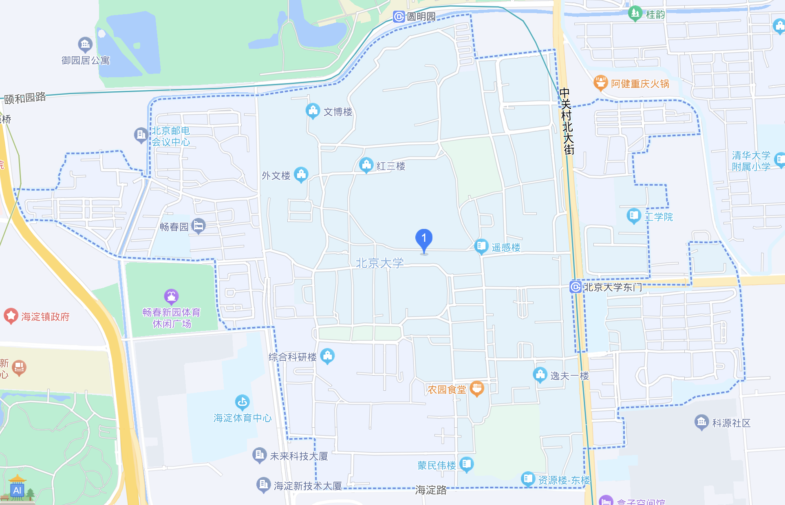
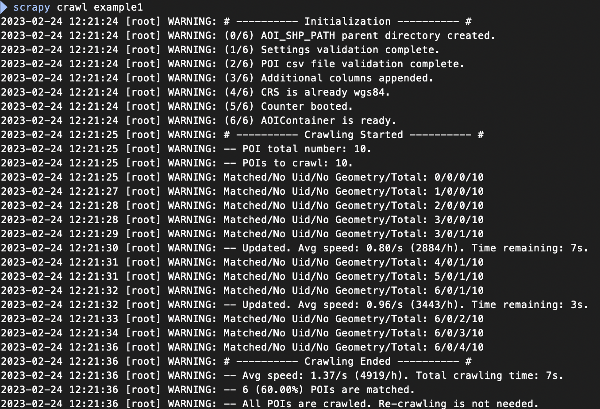
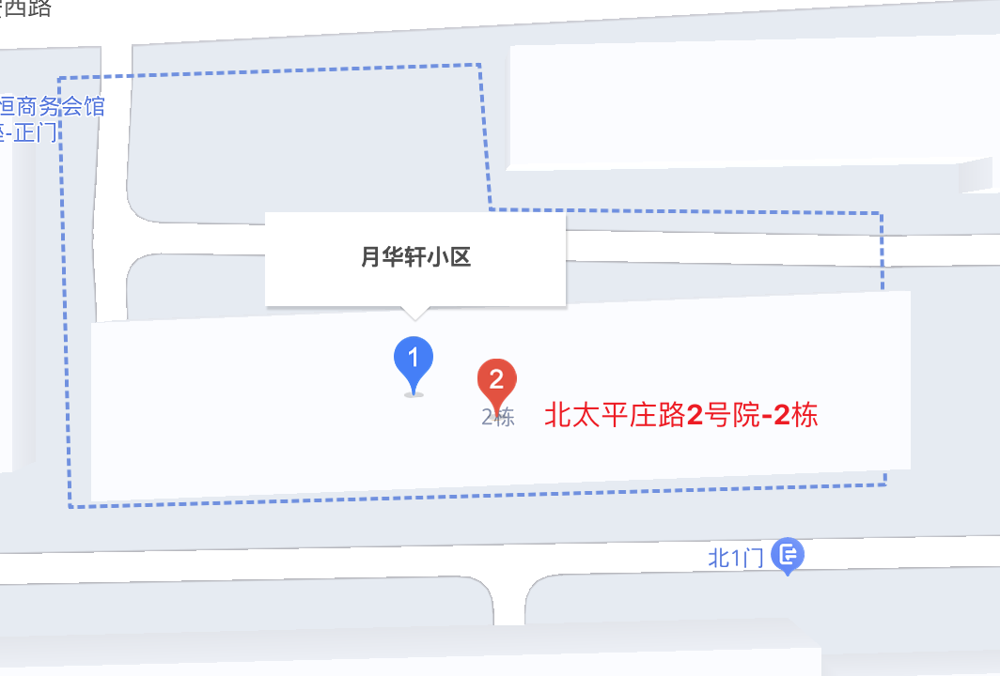

# BaiduAOISpider

## 项目简介

基于 Scrapy 框架的百度地图 AOI（Area of Interest）[^1]/ 矢量边界数据的 Python 多线程爬虫。根据给定 POI 数据（即包含名称 + 经纬度的数据），按一定条件匹配合适的 AOI 数据，将结果保存为 csv 格式和 shp （ESRI shapefile）[^2]格式。

### 项目特点

* 需要提前准备目标 POI 数据， POI 获取方法可参考其他项目例如 [AMapPoi](https://github.com/Civitasv/AMapPoi)

* 项目内可以选用一定的反爬手段，包括：随机 user-agent、随机 cookie、使用随机代理[^3]

* 爬取结果和爬取状态直接保存在原始 POI 数据 csv 上，可以随时中断、继续爬取和重新爬取

* 提供了一些 AOI 的匹配和筛选条件，可根据需求自行修改，便于获取更精准的结果

### 应用场景

相较于直接爬取整块空间区域内的所有 AOI 的方法（例如项目 [poi](https://github.com/liujiao111/poi)），本项目有如下的使用场景：

* 因为 POI 数据获取更容易，当你手上已经有一份筛选好的 POI 数据，只需要匹配每个 POI 对应的 AOI

* POI 是根据别的来源确定的，例如爬取的带有经纬度坐标的签到数据、点评数据和房价数据等等。这时你不可能提前知道需要的 AOI 名单，因而必须先确定 POI、然后再去找匹配的 AOI

* 当你只需要一部分而不需要全量 AOI 数据时，想节约成本和时间（是的，百度 AOI 爬取 “基本上” 是付费的，详见 [API 参数配置](#api-参数配置)中关于 AK 的内容）

### 工作流程

爬虫的完整流程如下，即对 `baidu_aoi.py` 的说明：

* 初始化环境，包括：

  * 导入全局配置和局部配置的各参数，并核验是否合法
  
  * 导入 POI csv 文件，并核验是否合法
  
  * 添加：爬取状态、最终匹配的 AOI 的名称[^4]、WGS-84 坐标系[^5]下的经纬度、AOI 几何形状共 5 列字段
  
  * 将原始 csv 内的坐标统一到 WGS-84 坐标系
  
  * 启动和初始化计数器和 AOI 容器

* 将对应参数填入百度圆形区域地点检索 API 的 url[^6]：`https://api.map.baidu.com/place/v2/search?query=名称&location=纬度,经度&radius=搜索半径&ak=您的密钥&output=json&coord_type=1`

  * 该 API 根据地名返回 `json` 格式的可能 POI 的列表，每个 POI 中包含名称、经纬度、其他附加信息，以及 `uid`（如果存在的话），每一个 uid 对应一个几何形状，即我们想要的 AOI
  
  * 下文中为了将上述返回结果中的 POI 和原始 POI csv 区分开来，**将检索结果中的 POI 以 uid 代称**，事实上这一步骤的核心就是获取所有可能的 uid
  
  * 如果想在搜索中限定 POI 的种类，还可以添加 `prim_ind`（[百度标准](https://lbsyun.baidu.com/index.php?title=open/poitags)的 POI 一级行业分类）和 `sec_ind`（二级行业分类）两个参数[^7]

  * 如果这一步没有检索到任何 uid，那么将爬取状态设置为 `No Uid`

* 将 uid 填入查询 AOI 的 url：`https://map.baidu.com/?newmap=1&qt=ext&uid=查询到的uid&ext_ver=new&ie=utf-8&l=11`，然后提取几何形状，如果该几何形状满足 AOI 的筛选条件（例如其四至范围[^8]必须包含 POI 的经纬度等等），将该几何形状存入 AOI 容器中。这样对于每个原始 POI 能获取到一个可能的 AOI 列表

  * 如果这一步所有 AOI 都满足筛选条件，那么将爬取状态设置为 `No Geometry`

* 根据 `settings.py` 中 `FILTER_RULES` 的设置，计算 AOI 列表的综合排序值，将排序第一位的 AOI 作为最终匹配的 AOI

  * 提供了以下几种排序方法：（1）上一步的百度检索排序、（2）AOI 面积排序、（3）和原 POI 距离排序、（4）文本相似度排序，综合排序是其中被设置开启的方法的算术平均值的再排序
  
  * 例如，假设在有 3 个可能 AOI、并且四种方法都开启
  
    * 四种排序的结果为：（1）1、2、3；（2）2、3、1；（3）3、1、2；（4）3、2、1

    * 那么算数平均值为：9/4、8/4、7/4，再排序为：3、2、1

    * 因此最终匹配的 AOI 为第三个

  * 匹配到 AOI 后，将爬取状态设置为 `Matched`

总结整个工作流程如下：

```text
POI csv 读取 → 每个 POI 信息拼接 url → 一个 url 返回一组 json 格式的 uid 列表

→ 用每个 uid 查询 AOI → 得到每个 POI 的可能 AOI 列表 → 综合排序，取第一位的 AOI
```

#### 流程案例说明

例如对 `北京大学, 116.30420708125263, 39.991595084258336` 进行爬取：

* 拼接出地点检索 url：<https://api.map.baidu.com/place/v2/search?query=北京大学&location=39.991595084258336,116.30420708125263&radius=2000&ak=您的密钥&output=json&coord_type=1&tag=教育培训;高等院校&scope=2>

* 返回结果如下，提取出所有的 uid：

  ```json
  {
      // some information
      // ...
      "results": [
          {
              "name": "北京大学",
              "location": {
                  "lat": 39.998877,
                  "lng": 116.316833,
              },
              "address": "北京市海淀区颐和园路5号",
              "province": "北京市",
              "city": "北京市",
              "area": "海淀区",
              "telephone": "(010)62752114",
              "detail": 1,
              "uid": "ddfd7c2d8db36cf39ee3219e"
              "detail_info":{
                  "tag":"教育培训;高等院校",
                  // ...
              },
              // more information
              // ...
          },
          // more uids
          // ...
      ]
  }
  ```

* 对每一个 uid，拼接并访问 AOI 查询 url，例如：<https://map.baidu.com/?newmap=1&qt=ext&uid=ddfd7c2d8db36cf39ee3219e&ext_ver=new&ie=utf-8&l=11>，返回结果形如：

  ```json
  {
      // some information
      // ...
      "content": {
          "geo": "4|12946839.266068,4837125.446178;12949751.777560,4839020.969541|1-12948599.7094790,4837127.8547043,...,12948599.7094790,4837127.8547043;",
          "uid": "ddfd7c2d8db36cf39ee3219e"
      },
      // some information
      // ...
  }
  ```

* 提取每一个可能的 AOI，进行综合排序并获取最后匹配的 AOI，结果就是下图中蓝色虚线的几何形状：

  

## 项目运行

* 下载代码  
  
    ```bash
    # 或者直接手动下载
    git clone git@github.com:Prufrok/BaiduAOISpider.git
    ```

* 安装环境（基于 anaconda）

    ```bash
    # 创建虚拟环境并安装依赖
    conda env create -n BaiduAOISpider -f env.yaml

    # 激活新环境
    conda activate BaiduAOISpider
    ```

* 阅读[配置说明](#配置说明)，按照实际需求修改 `settings.py`

    ```Python
    # BaiduAOISpider/settings.py
    # 修改百度地图 API 密钥
    # 在百度地图开放平台注册、登陆并申请服务端密钥：
    # https://lbsyun.baidu.com/apiconsole/key
    AK_LIST = ['your_baidu_map_aks',]

    # 根据使用需要，修改其他设置，例如：
    CONCURRENT_REQUESTS_PER_IP = 20 # 调整每个 ip 的并发请求数
    UPDATE_INTERVAL = 100 # 调整更新间隔
    ```

* 注意：**爬取大量数据的情况下，建议请使用代理 IP**，具体见[基础设置](#基础设置)中的 `PROXY_ENABLED` 参数

* 准备 POI 数据

  * POI 数据必须为 csv 格式，放入 `data` 文件夹下。文件名任意，但是需要与 `settings.py` 中的 `POI_CSV_PATH` 匹配

  * POI csv 必须包含：`name`（POI 名称）、`lng`（经度）、`lat`（纬度）三个字段
  
    * 如果想要在检索中对每个 POI 限定它的类别，还可以添加 `prim_ind` 和 `sec_ind` 两个字段，详见 [API 参数配置](#api-参数配置)

* 运行爬虫

    ```bash
    # 进入项目根目录
    cd "your directory/.../BaiduAOISpider"

    # 运行爬虫，spider_name 为爬虫类中的 name 属性，例如：
    # BaiduAOISpider 为 BaiduAOI，Example1 为 example1
    # 如果中断继爬、重爬，只需再次运行同样的命令即可
    scrapy crawl spider_name
    ```

* 运行过程截图（示例 1 的情况）

  * 爬取状态记录格式为 `Matched/No Uid/No Geometry/Total | Crawled (Percentage)`，从左至右含义：匹配到 AOI 的 POI 数量、地名检索中不存在 uid 的 POI 数量、没有返回 AOI 几何信息或所有 AOI 都不符合过滤条件的 POI 数量、总共的 POI 数量、已爬取的 POI 数量（匹配到、无 uid、无 AOI 三种情况的总数）、已爬取的 POI 数量占总数的百分比

    

## 配置说明

### 配置类别

总共有两种配置方法：

* **全局配置**，即在 `settings.py` 中进行设置

* **局部配置**，可设置的内容和全局配置完全一样，不过需要在每个爬虫类内的 `updating_settings` 变量中设置。**局部配置的优先级高于全局配置**。局部配置后，使用“深度” `update` 方法，对全局配置中的设定进行更新，例如：

  * 如果在 `settings.py` 中设置：

    ``` python
    CONCURRENT_REQUESTS = 25
    FILTER_RULES = {
        'min_aoi_area': 0,
        'min_similarity': 0,
    }
    ```

  * 而在 `updating_settings` 中设置：
  
    ``` python
    CONCURRENT_REQUESTS = 30
    FILTER_RULES = {
        'min_similarity': 0.1,
    }
    ```

  * 最终爬虫使用的设置为：

    ```python
    CONCURRENT_REQUESTS = 30
    FILTER_RULES = {
        'min_aoi_area': 0,
        'min_similarity': 0.1,
    }
    ```

### 配置内容

可设置的内容分为以下两个部分：

* **默认配置**，不需要修改。包括请求头、开启中间件、日志等级以及scrapy基础设置等等

* **运行配置**，需要根据实际需求修改，运行配置内又分为四类：[并发配置](#并发配置)、[基础配置](#基础设置)、[API 参数配置](#api-参数配置)和 [AOI 筛选配置](#aoi-筛选配置)，下面将分别详细介绍

#### 并发配置

包含 scrapy 框架的三个并发参数：`CONCURRENT_REQUESTS`、`DOWNLOAD_DELAY` 和 `CONCURRENT_REQUESTS_PER_IP`。这三个参数的含义和使用方法可以参考[官方文档](https://docs.scrapy.org/en/latest/topics/settings.html#concurrent-requests-settings)。需要注意的是：

* **百度地图地点检索 API 的并发上限是 30 QPS**，因此至少 `CONCURRENT_REQUESTS_PER_IP` 的值不应超过 30

* 按照项目目前的设置，并发峰值在 10 QPS 左右，大约每小时能匹配完 4000 至 5000 条原始 POI（对地点检索结果下 10 个左右 uid 进行抓取的情况下）

* **适度地设置抓取速度，建议不用追求最大化的并发**，减小爬取行为带来的负担和避免可能关闭 AOI 查询 url 的风险

#### 基础设置

* `POI_CSV_PATH`：POI 数据文件路径，同时也是 csv 结果的保存路径

* `AOI_CSV_PATH`：shp 结果保存路径，如果上级文件夹不存在会自动创建

* `PROXY_ENABLED`：是否使用随机代理，`1` 代表是，`0` 代表否

  * 如果使用随机代理，需要在 `middlewares.py` 中设置代理池：

    * 本项目默认采用的代理池来自 [proxy_pool](https://github.com/jhao104/proxy_pool) 项目，需要按照该项目进行额外配置

    * 地点检索和 AOI 查询 url 都是 https 协议，因此**使用的随机代理也要支持 https 协议**

    * 如果自己搭建代理池，还需要构造获取一个随机代理和删除某一个代理的 2 个函数，并替换 `middlewares.py` 中的 `get_proxy` 和 `delete_proxy`

  * 是否使用随机代理的可能影响：
  
    * 地点检索作为百度公开的 API 接口应该没有反爬限制，所以是否使用应该没有影响

    * AOI 查询的 url 应该不算是公开 API，因此如果不使用代理，可能会被封 IP（不保证，个人没有尝试过大批量数据下不开代理爬取）

    * 此外，以前高德网站也有类似的 AOI 查询 url，但是在大量爬取之后，这个 url 最后被关闭了[^9]

    * 再次提醒：**强烈建议如果要爬取大量数据，请开启使用代理，并且请不要过于[频繁爬取](#并发配置)**

* `UPDATE_INTERVAL`：更新间隔，单位为次

  * 在隔多少次数的总 AOI 访问后进行：（1）文件保存、（2）阶段性爬取状态统计

* `USE_FIRST_UID`：是否使用第一个 uid，`1` 代表是，`0` 代表否

  * 如果使用，那么把百度地点检索 API 结果中的第一个可用 uid 当作可能的最终匹配 AOI（还需要验证是否符合 AOI 筛选条件），即只采用百度检索结果排序来进行筛选

  * 如果不使用，那么将对 API 检索结果中所有 uid 进行抓取，然后再根据 `FILTER_RULES` 中设立的规则和 AOI 自身的筛选条件进行筛选

  * 开启后，会加快整体爬取速度，但是会造成一定的不匹配和遗漏，因为百度的最佳搜索结果并不一定是准确的

#### API 参数配置

* `API_PARAMS`：百度地点检索 API 的参数，包括以下几类：

  * **行业分类参数**（`prim_ind` 和 `sec_ind`）

    * 需要按照[百度标准](https://lbsyun.baidu.com/index.php?title=open/poitags)对类别进行重分类

    * 如果不需要开启，将值设为 `''`，可以只开启一个，也可以同时开启两个

    * 如果需要开启，并且所有 POI 是同一种类的情况下，直接填入对应类别即可，例如：

      ```python
      API_PARAMS = {
        'prim_ind': '房地产',
        'sec_ind': '住宅区',
      }
      ```

    * 如果需要开启，但是 POI 类别不同，需要：（1）将参数值设置为 `VAR`（作为变量输入的意思）；（2）在 csv 文件中添加对应的列

  * **搜索半径参数**

    * `radius`：搜索半径大小，单位为米。建议将值设置的稍微大一点避免遗漏，例如 2000（m）

    * `radius_limit`：是否限制结果一定要在搜索半径内，`true` 代表是，`false` 代表否，建议开启

  * **坐标系参数**

    * `crs`：POI csv 中 `lng` 和 `lat` 的坐标系，可以为 `bd09`（百度坐标系）、`gcj02`（火星坐标系）、`wgs84`（GPS 坐标系）

    * 各坐标系含义可以参考[这篇文章](https://www.jianshu.com/p/559029832a67)。简略地说：如果坐标来源于百度地图，那么就是 `bd09`；如果坐标来源于高德地图，那么就是 `gcj02`；如果坐标来源于 GPS，那么就是 `wgs84`

    * 如果你不知道手上数据的坐标系，可以挑选几个点，然后使用例如[地图坐标系转换 - 在线工具](https://tool.lu/coordinate)、[经纬度查询定位](https://www.lddgo.net/convert/position)等等工具查看比对一下

* `AK_LIST`：百度地点检索 API 的密钥列表，可以有多个但至少提供一个

  * 密钥每天仅可以免费使用地点检索功能 100 次，**按 30 元 / 万次收费，每次最低充值 100 元**

  * 曾经有说法是使用 ”多个密钥 + 多 ip“ 可以累加每日免费爬取额度[^10]，但经测试多个密钥之间是共享使用额度的、并且多 ip 并没有凑效，**因此只提供一个可用密钥即可**

#### AOI 筛选配置

`FILTER_RULES` 包括以下几类：

* **检验 AOI 是否合法的规则**

  * 面积筛选规则

    * `min_aoi_area`：最小 AOI 面积，单位为平方公里，设置为 0 则不限制

    * `max_aoi_area`：最大 AOI 面积，单位为平方公里，设置为很大的正数则不限制，例如 10000（km^2）

  * 文本相似度规则

    * `min_similarity`：最小文本相似度，设置为 0 则不限制，最大值为 1

    * 文本相似度选择使用 Python 自带库 `difflib` 中的 `SequenceMatcher` 计算，计算原理可以参考[这里](https://stackoverflow.com/questions/35517353/how-does-pythons-sequencematcher-work)

    * 这一规则是为了筛除和原始 POI 名称过于不同的 AOI，需要将参数值设置成较小的正数，例如 0.1

    * 然而，会出现一些特殊情况，例如对北京 “北太平庄路 2 号院” 这一小区进行检索，在不限制文本相似度的情况下，会返回 “月华轩小区” 的 AOI。从名称上看，两者毫无干系，然而查看地图会发现，这两者很可能就是同一个小区。因此需要**自行定夺是否开启筛选**

      

* **AOI 合法后，对所有可能的 AOI 的排序规则**

  * `sort_by_search_rank`：是否按照百度地点检索 API 的搜索排名进行排序。`0` 代表否；`1` 代表是，并且排名越高（排名数字越小）越好

  * `sort_by_area`：是否按照 AOI 面积进行排序。`0` 代表否；`1` 代表是，并且面积越大越好；`-1` 代表是，并且面积越小越好

  * `sort_by_distance`：是否按照 AOI 到 POI 点的距离进行排序。`0` 代表否；`1` 代表是，并且距离越近越好

  * `sort_by_similarity`：是否按照文本相似度进行排序。`0` 代表否；`1` 代表是，并且相似度越高越好

## 项目结构

```text
BaiduAOISpider
├── README.md
├── BaiduAOISpider
│   ├── middlewares.py  中间件
│   ├── settings.py  各项设置
│   └── spiders
│       ├── BaiduAOI.py  百度地图爬虫
│       └── examples.py  示例爬虫
├── data
│   ├── AOI_example1  示例 1 爬取的 shp 格式数据
│   │   ├── AOI_example1.cpg
│   │   ├── AOI_example1.dbf
│   │   ├── AOI_example1.prj
│   │   ├── AOI_example1.shp
│   │   └── AOI_example1.shx
│   ├── AOI_example2  示例 2 爬取的 shp 格式数据
│   │   ├── AOI_example2.cpg
│   │   ├── AOI_example2.dbf
│   │   ├── AOI_example2.prj
│   │   ├── AOI_example2.shp
│   │   └── AOI_example2.shx
│   ├── POI_example1.csv  示例 1 原始数据及爬取的 csv 格式数据
│   └── POI_example2.csv  示例 2 原始数据及爬取的 csv 格式数据
├── env.yaml  conda 环境配置文件
├── images
│   ├── AOI_Peking_University.png
│   ├── running_process.png
│   └── similarity_problem.png
├── processor
│   ├── __init__.py
│   ├── aoi_container.py  AOI 容器类，用于存储、处理 AOI 数据
│   ├── api_handler.py  百度地图 API 处理类
│   ├── counter.py  计数器类
│   ├── file_operator.py  文件操作类
│   ├── logger.py  日志类
│   ├── repository.py  仓库类，用于存放爬虫用到的各类设置和文件
│   └── validator.py  验证器类
├── scrapy.cfg
└── spatial
    ├── coords.py  坐标处理函数
    └── geometry.py  几何处理函数
```

## 示例说明

在 `examples.py` 中提供了两个示例 `example1` 和 `example2`，分别展示了两种不同使用情景：

* **示例一：**

  * 目标是北京的一些住宅小区 AOI

  * 在默认设置上更新了：限制单一 POI 类别（房地产 + 住宅区）、AOI 最大面积 1 平方公里、最小文本相似度 0.1

    ```python
    updating_settings = dict(
        POI_CSV_PATH = 'data/POI_example1.csv',
        AOI_SHP_PATH = 'data/AOI_example1/AOI_example1.shp',
        PROXY_ENABLED = False,
        UPDATE_INTERVAL = 20,
        API_PARAMS = {
            'prim_ind': '房地产',
            'sec_ind': '住宅区',
        },
        FILTER_RULES = {
            'max_aoi_area': 1,
            'min_similarity': 0.1,
        },
    )
    ```

* **示例二：**

  * 目标是一些分布在全国的不同类别、较大型的 AOI，例如大学校园、风景区、体育场馆等等，并且坐标来源是百度地图

  * 在默认设置上更新了：在 csv 文件中指定了 POI 的类别、给定坐标系为 `bd09`、最小 AOI 面积为 0.02 平方公里、开启按照面积从大到小排序

    ```python
    updating_settings = dict(
        POI_CSV_PATH = 'data/POI_example2.csv',
        AOI_SHP_PATH = 'data/AOI_example2/AOI_example2.shp',
        PROXY_ENABLED = False,
        UPDATE_INTERVAL = 20,
        API_PARAMS = {
            'prim_ind': 'VAR',
            'sec_ind': 'VAR',
            'crs': 'bd09',
        },
        FILTER_RULES = {
            'min_aoi_area': 0.02,
            'sort_by_area': -1,
        }
    )
    ```

## 参考

1. 主体框架部分参考：[ResidentialAreaBoundary](https://github.com/XuCQ/ResidentialAreaBoundary) 项目

2. AOI 爬取的一些相关讨论：[《利用名称爬取百度AOI》](https://www.cnblogs.com/zhangqinglan/p/13301425.html)、[《黑科技 | 百度地图抓取地块功能（上）》](https://zhuanlan.zhihu.com/p/111256406)、[《黑科技 | 百度地图获取地块功能属性（下）》](https://zhuanlan.zhihu.com/p/111263995)

3. 坐标计算相关函数 `coords.py` 参考 [CoordinatesConverter](https://github.com/dickwxyz/CoordinatesConverter) 项目

[^1]: 兴趣面（area of interest，简称 AOI），也叫信息面，指的是地图数据中的区域状的地理实体。参考来源：[百度百科](https://baike.baidu.com/item/%E5%85%B4%E8%B6%A3%E9%9D%A2/61305284？fr=aladdin)

[^2]: ESRI Shapefile（shp），或简称 shapefile，是美国环境系统研究所公司（ESRI）开发的一种空间数据开放格式，该文件格式已经成为了地理信息软件界的一个开放标准。参考来源：[百度百科](https://baike.baidu.com/item/shapefile%E6%96%87%E4%BB%B6/11041662?fr=aladdin)

[^3]: 随机 user-agent 和 随机 cookie 默认开启使用，前者通过 `scrapy-fake-useragent` 包实现，后者在 `middlewares.py` 中的 `get_cookie` 中实现；随机 IP 代理需要在 `settings.py` 中选择是否开启

[^4]: 在结果文件中字段叫做 uid 名称，因为每一个 uid 对应一个 AOI 查询的url，进而对应一个几何形状，而获取 AOI 的 url 返回的数据里其实是没有名称的

[^5]: WGS-84 坐标系（World Geodetic System 一 1984 Coordinate System）是一种国际上采用的地理坐标系。GPS 是以 WGS-84 坐标系为根据的（因此 GPS 的经纬度就是在 WGS84 坐标系下的经纬度）。参考来源：[百度百科](https://baike.baidu.com/item/WGS-84%E5%9D%90%E6%A0%87%E7%B3%BB/730443)

[^6]: 类似的项目往往采用最基础的 “行政区划区域检索” url，即还需要 POI 所在的市和区县作为参数，这在已经有每个 POI 经纬度定位的条件下是多余的

[^7]: 如果两级分类都提供，就添加 `&tag=一级行业分类;二级行业分类&scope=2`；如果只提供了其中一级分类，就添加 `&tag=一级/二级行业分类&scope=2`。设置 `&scope=2` 会返回检索结果中每一个 uid 的详细信息包括行业分类信息，进而再次确认每个检索结果的行业分类是一致的

[^8]: 四至点，即几何形状的左上、右上、右下、左下的四个顶点

[^9]: 见[《Python 批量爬取高德 AOI 边界数据 + GIS 可视化（超详细）》](https://blog.csdn.net/Smart3S/article/details/88606789)的评论区

[^10]: 见[《如何绕过百度地图 API 的调用次数限制？》](http://www.site-digger.com/html/articles/20160421/122.html)
